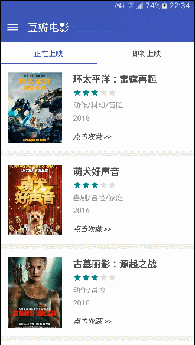
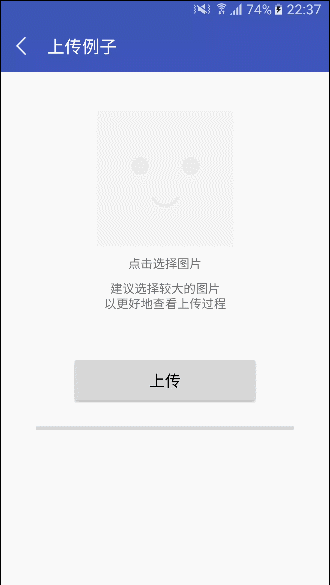
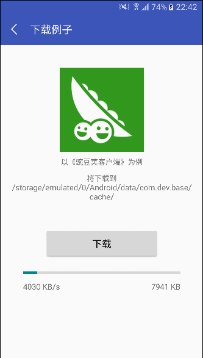
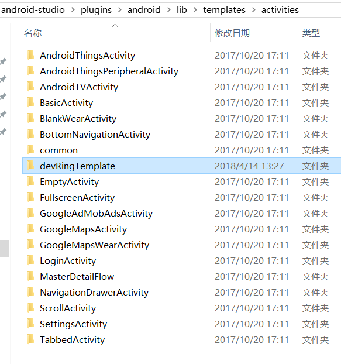
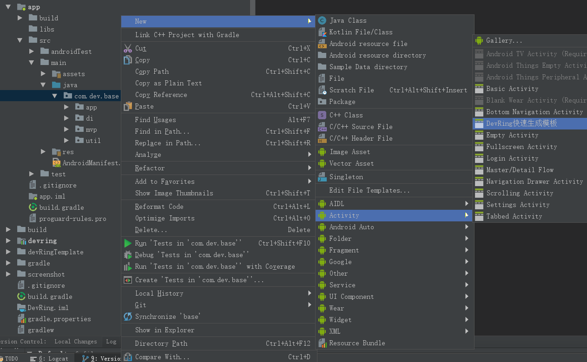
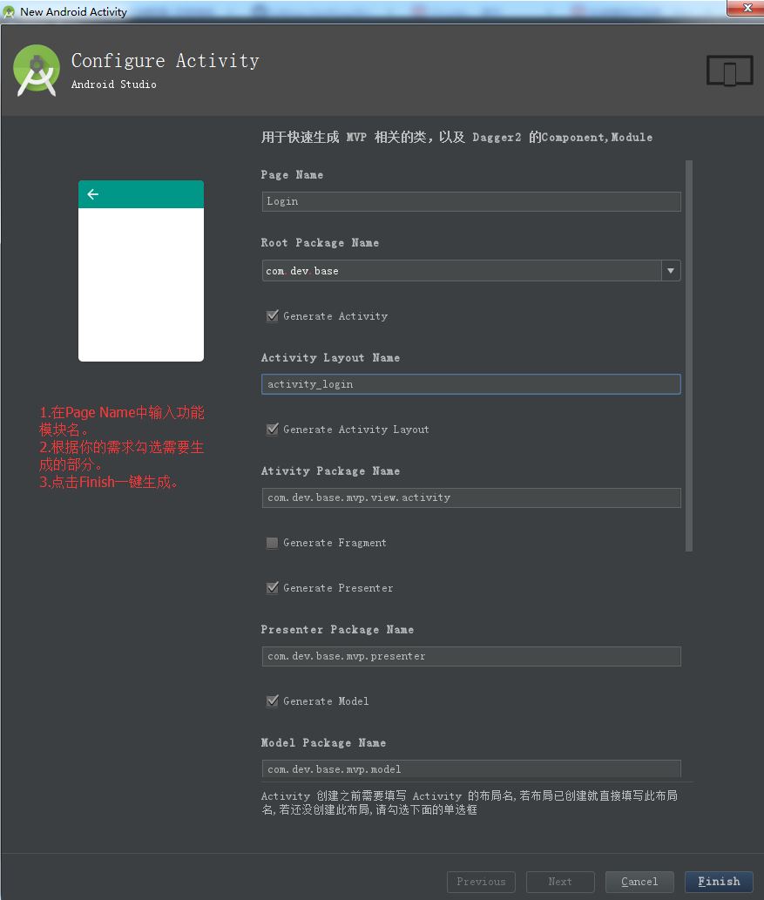

# MVP+Dagger

## 介绍
演示如何应用MVP开发模式、以及Dagger2依赖注入。  
其中网络请求、图片加载、数据库等操作，使用的是[DevRing基础开发库](https://github.com/LJYcoder/DevRing)，欢迎了解和★star

## Demo运行图
&nbsp;&nbsp;&nbsp;
 
 
&nbsp;&nbsp;&nbsp;

## 一键生成MVP、Dagger2代码
可快速生成MVP相关代码，如Model、Activity/Fragment、Presenter、IModel、IView.
 
可快速生成Dagger2相关代码，如Component、Module.
 
修改自[JessYan的模板](https://github.com/JessYanCoding/MVPArmsTemplate)，根据**Demo的代码结构**以及个人需求进行了调整。
### 步骤1
拷贝**devRingTemplate**文件夹到以下位置，然后**重启Android Studio**
 
- Windows:   AS安装目录/plugins/android/lib/templates/activities
- Mac:   /Applications/Android Studio.app/Contents/plugins/android/lib/templates/activities  

### 步骤2
在项目的根包名(如com.dev.base)下右键--->New --->Activity --->DevRing快速生成模板。
 
 

### 步骤3
在Page Name中输入功能模块名，然后根据需要勾选你要生成的部分，点击Finish一键生成。
 
 

 
 

## 相关博客
相关框架的用法介绍，如果觉得对你有帮助，欢迎关注点赞~  

[DevRing使用说明](https://www.jianshu.com/p/abede6623c58)
 
[MVP](http://www.jianshu.com/p/1f91cfd68d48)
 
[Dagger2](https://www.jianshu.com/p/08b1fd6fb53b) 
 

---
有什么问题或建议，可以提issue或者简书告知。
 
如果觉得对你有帮助，不妨点个**★star**支持鼓励我~
